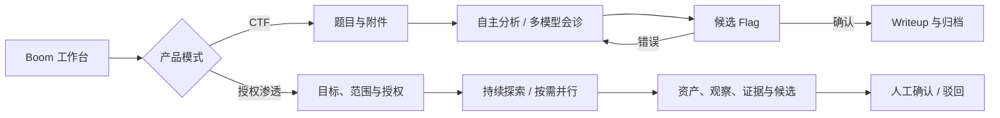

<div align="center">

<h1>
  <picture>
    <source media="(prefers-color-scheme: dark)" srcset="./frontend/public/ctf-boom-logo-dark.svg" />
    
  </picture>
</h1>

**面向 CTF 与授权渗透测试的自主 AI Agent 与桌面工作台**

从题目导入、隔离分析和多模型会诊，到资产探索、Flag / 漏洞审核、证据留痕与 Writeup 生成。


</div>

> [!IMPORTANT]
> CTF-Boom 仍处于积极开发阶段，配置格式和运行行为可能变化。请仅在获授权的 CTF、靶场和安全研究环境中使用。

## 项目简介

CTF-Boom 是一个以证据为中心的自主安全任务系统。它提供 CTF 解题和授权渗透两种产品模式，把输入文件、模型推理、工具调用、候选 Flag / 漏洞、人工或平台判定以及最终产物组织在可追踪的任务生命周期中。

项目名称为 **CTF-Boom**；产品内的默认 Agent 名称为 **Boom**，命令行入口为 `boom`。

与一次性聊天不同，Boom 会为每个任务创建独立工作区，持续保存关键发现和分析产物。CTF 模式可在主模型停滞时发起受限的第二意见或多模型会诊；渗透模式会恢复同一会话和项目笔记，在明确授权范围内分阶段推进。

## 核心能力

- **自主解题**：面向 `WEB`、`PWN`、`REVERSE`、`CRYPTO`、`MISC`、`MOBILE`、`FORENSICS`、`AI`、`HARDWARE`、`BLOCKCHAIN`、`OSINT` 等题型进行分类与分析。
- **双产品模式**：左侧导航可在 CTF 与授权渗透工作台之间切换；两种模式共享 Provider、执行环境和任务目录。
- **自主渗透与 Flag 获取**：以目标、范围和授权声明创建任务，支持常规安全评估或多目标 Flag 获取；Agent 可持续运行、暂停、恢复，并在路径独立时委派受限 Worker 并行推进。
- **结构化安全记录**：资产、观察、证据、漏洞发现、Flag 候选和工具运行分别留痕；漏洞只有具备证据引用和复现步骤后才能人工确认。
- **隔离工作区**：每次运行复制题目输入，分析文件统一写入 `work/`，关键结论沉淀到 `NOTES.md`。
- **候选 Flag 生命周期**：CTF 候选会等待比赛平台或用户判定；渗透 Flag 获取会持续推进其他目标，并把每个候选交给用户独立确认或驳回。
- **多模型协作**：支持 Economy / Strong 两档模型、停滞时的只读第二意见，以及由 2–4 个专家模型和 Strong 模型汇总的会诊流程。
- **模型热切换**：任务运行期间可调整模型或 Provider 配置；Boom 会在安全边界完成交接，并保留工作区、笔记和已完成的工具结果。
- **可审计执行**：支持 `managed`、`isolated`、`static-only` 三种执行模式，带命令超时、输出限制、重复调用检测和审计记录。
- **CTF 默认执行到底**：默认不设累计 token 上限；正常让出、静默、超时或反循环保护只会触发保存现场并续跑，直到得到结果、比赛调度明确收盘或用户手动停止。需要成本硬上限时可在 GUI 开启 token 预算，或在 CLI 传 `--tokens`。
- **桌面工作台**：macOS 原生窗口提供题目与授权任务管理、实时活动、历史记录、证据查看、任务暂停 / 取消、候选审核和 Writeup 触发；也提供浏览器兼容模式。
- **Provider 与凭据隔离**：支持 OpenAI-compatible Chat Completions、OpenAI Responses 和 Anthropic Messages；凭据保存在 Boom 私有存储中，不会隐式继承 OpenCode 配置。
- **比赛平台接入**：可插拔的平台适配器（内置 DASCTF Agent API），同步分批放出的赛题、按需申请靶机，并自动提交 Flag。
- **Boom 托管 MCP**：远程或本地 MCP Server 由 Boom 单独配置、启停和授权，不读取用户全局或题目目录中的 OpenCode MCP 配置。

## 工作流程



## 快速开始

### 环境要求

- [Bun](https://bun.sh/) 1.3 或更高版本（项目锁定版本见 `package.json`）
- 可用的模型 Provider 与模型凭据
- 一个明确配置的 Python / Conda 环境
- macOS：可使用原生桌面客户端；其他环境可使用 CLI 或浏览器界面
- 可选：Docker 或 Podman，用于 `isolated` 执行模式

### 从源码安装

克隆仓库并进入项目目录后执行：

```sh
bun install
bun link
boom doctor
```

`boom doctor` 会检查 Bun、运行时、Provider、Agent 资源、Python 环境、MCP Server 和容器隔离能力。如果结果显示 `Python unconfigured`，请先在桌面设置中创建 Python 环境配置，或运行任务时传入 `--python` / `--python-profile`。

### 启动桌面工作台

```sh
boom gui
```

默认工作目录是 `~/BoomProject`：Boom 首次启动会创建它，并在其中放好 `challenges/`、`eval/`
和 `tasks/`。想换目录可用 `--root`，也可以在界面右上角直接切换，或到 **设置 → 工作目录**
里编辑默认工作目录（保存后立即切换，下次启动仍打开该目录；`恢复默认` 回到 `~/BoomProject`）。

同一个 **设置 → 工作目录** 面板还负责工作区维护：**备份工作区** 可指定名称，把整个工作目录
打包成 `<Boom 数据目录>/backups/<名称>.tar.gz`；**清空工作区** 删除 `challenges/`、`tasks/`
和 `eval/` 里的题目、任务记录与答案后重建空骨架，工作目录里你自己的文件（writeup、字典等）保持不动。

题目不需要手动准备目录：在左侧题目队列点 **＋ 新建题目**，填题目 ID、分类、题面，用
**选择文件** 把附件复制进题目目录，需要时再写入已知答案。右键题目或打开题目后的菜单里可以
随时 **编辑题面 / 附件 / 答案**。想沿用已有的题目目录，用旁边的 **从目录导入题目**
（或 `boom migrate` 迁移旧版工作区）。

左侧竖栏可直接切换 **CTF 模式** 与 **渗透模式**；切换只改变工作台入口，不会中断或改写
另一种模式的任务。

仓库自带六道本地示例题：

```sh
boom gui --root ./examples/ctf
```

首次启动后，在 **设置** 中完成：

1. 连接 Provider 并选择 Economy / Strong 模型；
2. 选择现有 Python 解释器或 Conda 环境；
3. 按需配置多模型会诊池、MCP Server 和比赛平台。

浏览器兼容模式：

```sh
boom gui --browser --root ./examples/ctf
```

仅启动本地 API，不自动打开窗口：

```sh
boom gui --headless --root ./examples/ctf
```

### 通过桌面端开展授权渗透测试

在左侧竖栏进入 **渗透模式**，点击 **新建授权任务**，填写主要目标、测试范围、任务目标与限制，
并确认已获得明确授权。任务可选择：

- **安全评估**：持续记录资产、观察、证据和候选漏洞；候选漏洞至少关联一条证据和一条可复现步骤后，才能由用户确认。
- **Flag 获取**：按独立目标跟踪 Flag；主 Agent 负责公共前置与路径拆分，受限 Worker 可并行解决互不依赖的路径。任何 Agent 得到 Flag 后都会立即登记候选，用户确认或驳回不会丢失其他路径的进度。

Boom 会探测当前 `PATH` 中可用的常见安全工具，并把命令、输出、退出状态和解析结果写入任务记录；
当前对 nmap XML 结果可自动归一为资产和端口观察。任务可以暂停后继续，归档或放弃会先停止
该任务的 Agent 与宿主工具进程，删除则移动到工作区内可恢复的 `.trash`。

> [!CAUTION]
> 渗透任务中的授权范围是持久化的审计事实和 Agent 约束，不是网络层 egress 防火墙。请只在你拥有明确授权的目标和范围内使用 Boom。

### 通过 CLI 解题

运行单道示例题：

```sh
boom run --root ./examples/ctf \
  --strong-model <provider/model> \
  --economy-model <provider/model> \
  --python /absolute/path/to/python3 \
  warmup-base64
```

省略题目 slug 时，Boom 会并发处理 `<root>/challenges` 下的全部题目：

```sh
boom run --root ./examples/ctf \
  --strong-model <provider/model> \
  --economy-model <provider/model> \
  --python-profile <profile-id>
```

常用限制参数：

```sh
boom run --root ./ctf \
  --tokens 1000000 \
  --minutes 60 \
  --repeats 5 \
  --concurrency 4 \
  <challenge-slug>
```

查看完整帮助：

```sh
boom --help
```

## 题目目录规范

推荐按类别组织题目：

```text
ctf/
├── challenges/
│   ├── WEB/
│   │   └── login-bypass/
│   │       ├── README.md
│   │       ├── meta.json
│   │       └── attachments...
│   ├── PWN/
│   ├── REVERSE/
│   ├── CRYPTO/
│   └── MISC/
├── eval/
│   └── answers.txt
└── tasks/
```

- `README.md`：可选的题目描述。
- `meta.json`：可记录 `category`、`difficulty`、远程地址和 Flag 格式等元数据。
- `eval/answers.txt`：可选评测答案，格式为 `<slug> <flag>`；答案不会复制进 Agent 的运行工作区。
- `tasks/<slug>/<task-id>/`：每个任务的独立目录，CTF 解题与渗透任务使用同一套结构。

旧版扁平结构 `challenges/<slug>/` 仍可读取，并归类为 `OTHER`。所有类别中的 slug 必须全局唯一。

## 任务目录结构

Boom 用同一套结构承载 CTF 解题与授权渗透，界面里的任务和磁盘上的目录一一对应：

```text
<root>/
├── challenges/<CATEGORY>/<slug>/    题目：README.md、meta.json、附件
├── eval/answers.txt                 已知答案（自动判题，不进入运行工作区）
└── tasks/<slug>/<task-id>/
    ├── task.json                    宿主维护的记录（模式、状态、轮次、渗透记录）
    ├── result.json                  最近一次运行的结果摘要
    ├── NOTES.md                     跨轮次复用的结论与已排除方向
    ├── input/                       只读输入快照：题面与附件，或授权简报
    ├── records/                     宿主追加写：events.jsonl、tool-runs/
    └── work/                        只有 Agent 能写：分析、脚本、证据、Writeup
```

工作区备份默认放在 Boom 数据目录的 `backups/`（不是工作区内），因此 `清空工作区` 不会删掉它，
下一次备份也不会把上一次装进去。备份包含工作目录的全部内容，包括 `challenges/`、`tasks/`、`eval/`。

旧版工作区（`runs/`、`engagements/`、任务内的 `challenge/`、`work/events.jsonl`）仍可读取，
不需要迁移；想彻底并到新结构时运行：

```sh
boom migrate --root ./ctf          # 先预览
boom migrate --root ./ctf --apply   # 再写入
```

## 模型、会诊与执行环境

Boom 使用一套持久化的双模型策略：

- **Strong**：负责主解题流程和会诊汇总。
- **Economy**：负责受限的停滞第二意见；两档也可以选择同一个模型。

主 Agent 通过 `task` 工具委派子任务时按档位选择 Worker：`boom-worker` 运行在 Economy 档，适合有界的机械性工作（解码、解包、爆破、扫描）；`boom-worker-pro` 运行在 Strong 档，适合重推理分析（漏洞利用、反编译阅读、密码学推导），并可把机械性子任务继续下发给 `boom-worker`。两档 Worker 的模型在运行时配置编译时解析自当前 Economy/Strong 设置，修改档位策略会在安全边界重载运行时并交接。

重复 2–4 次 `--consult` 可以在 CLI 中配置会诊专家池，并在任务开始时进行规划会诊：

```sh
boom run --root ./ctf \
  --strong-model <provider/strong-model> \
  --economy-model <provider/economy-model> \
  --consult <provider/expert-a> \
  --consult <provider/expert-b> \
  --python-profile <profile-id> \
  <challenge-slug>
```

执行模式：

| 模式 | 用途 |
| --- | --- |
| `managed` | 默认模式，在经过清理的任务环境中执行并记录审计信息 |
| `isolated` | 使用可用容器运行时进行非 root 隔离执行 |
| `static-only` | 不允许运行未知程序，只进行静态分析 |

每个任务都会绑定明确的 Python 环境。Boom 不会在未配置时静默回退到其他解释器。

## 授权渗透模式

渗透任务分为 `assessment`（安全评估）和 `flag-hunt`（Flag 获取）两类。创建时必须保存主要
目标、测试目的、明确授权和至少一个 scope；操作员补充的账号、禁止动作和测试限制会作为固定
约束在每一轮重新提供给 Agent。

每个任务会持续维护五类可审计对象：

| 对象 | 含义 |
| --- | --- |
| 资产 | 根域名、子域名、IP、服务、应用或端点，可记录父子关系与发现来源 |
| 观察 | 端口、服务、HTTP、漏洞迹象或一般事实，不直接等同于漏洞结论 |
| 证据 | Boom 工具产物路径或外部材料摘录，并保留来源 |
| 发现 | `candidate` / `confirmed` / `rejected` 三态的漏洞主张 |
| 工具运行 | 原始参数、原因、状态、stdout / stderr、产物与可选归一化结果 |

Agent 的会话 ID、轮次、消费和阶段结论随任务持久化；继续任务会优先恢复原会话，并从
`NOTES.md`、最新正式记录和工具产物接续。Flag 获取模式还提供 `boom-pentest-worker`：主 Agent
只在路径已经独立时委派，Worker 不能继续递归委派，但可以直接登记自己取得的 Flag 候选；主、
子 Agent 会在下一次模型调用前收到去重后的共享进度更新。

## 比赛平台接入

比赛能力（自动拉题、靶机调度、无人值守巡航、Flag 提交）平台无关，平台差异收敛在适配器层；
当前内置 DASCTF Agent API 适配器（西湖论剑等 agent CTF 赛事使用）。默认可直接启动为本地
比赛工作台：

```sh
./start-gui.sh   # 默认工作区 ./ctf-workspace，可用 BOOM_ROOT 指定
```

工作区包含下载附件、运行记录、分析产物和提交台账，已被 Git 忽略。

首次使用请从 **设置 → 比赛平台控制台** 保存 AccessKey，并配置赛方要求的大模型网关。随后在
主界面同步分批赛题并点击 **开始比赛**，Boom 会进入无人值守巡航：自动拉取新题、按需申请靶机、
调度解题并提交候选 Flag。顶栏集中展示公告、实时排名、运行时与巡航状态、容器使用量，以及可
一键复制的待确认 Flag 计数。

适配器架构与接入新平台的方法见 [比赛平台接入](./docs/PLATFORMS.md)；DASCTF 的赛制约束、
接口实测偏差、凭证边界和调度策略见 [DASCTF 平台适配](./docs/platforms/dasctf.md)。

## MCP Server

Boom 将 MCP 配置保存在 `$BOOM_HOME/mcp.json`；未设置 `BOOM_HOME` 时，默认目录为 `~/.config/boom`。

```sh
# 远程 MCP Server；敏感值通过环境变量模板引用
boom mcp add remote-tools \
  --url https://example.com/mcp \
  --header 'Authorization=Bearer {env:MCP_TOKEN}'

# 本地 stdio MCP Server；命令以参数数组执行，不经过 shell
boom mcp add filesystem -- \
  npx -y @modelcontextprotocol/server-filesystem /data

boom mcp list
boom mcp test remote-tools
```

可以重复使用 `--agent`，将 MCP Server 限定给 `boom`、`boom-worker`、`boom-consultant`、
`boom-pentest`、`boom-flag-hunt` 或 `boom-pentest-worker` 等指定角色。

## 运行产物

每次任务运行都会写入：

```text
tasks/<slug>/<task-id>/
├── input/              # 只读题目快照与标准化元数据
├── records/            # 宿主持有的审计事件与工具执行记录
├── work/               # 完整分析、脚本、证据、候选结果和 Writeup
├── NOTES.md            # 可跨轮次复用的关键发现与已排除方向
└── result.json         # 运行状态、成本、Token 与候选 Flag 摘要
```

Boom 不把完整分析塞进聊天记录；可复现证据保留在 `work/`，长期有效的结论保留在 `NOTES.md`。Writeup 是确认 Flag 后单独触发的流程，必须包含可复现步骤和已确认的 Flag。

汇总已有运行结果：

```sh
boom evaluate --root ./ctf
```

## 开发与验证

```sh
bun install
bun run typecheck
bun run test
```

打包并测试本地发布物：

```sh
bun run pack:check
```

该命令会先构建 React 浏览器界面、执行类型检查和测试，再创建 tarball，验证其中包含
`frontend/dist` 与运行时资源，并在临时目录中从零安装后运行 `boom version` 和 `boom doctor`。
常规发布可直接运行 `bun pm pack`；`prepack` 钩子会执行相同的构建与质量检查。

核心实现使用 TypeScript、Bun、React 和 Vite。OpenCode 是当前稳定的产品运行时，所有 OpenCode 特定集成都集中在 `src/runtime.ts` 后面；Boom 自己负责 UI、任务生命周期、隔离配置、模型策略、MCP 管理和凭据引用。

进一步阅读：

- [运行时架构](./docs/RUNTIME_ARCHITECTURE.md)
- [授权渗透模式](./docs/PENTEST.md)
- [Flag 获取与按需并行](./docs/PENTEST_FLAG_MODE.md)
- [比赛平台接入](./docs/PLATFORMS.md)
- [DASCTF 平台适配](./docs/platforms/dasctf.md)
- [Provider 手动测试](./docs/M5_MANUAL_PROVIDER_TEST.md)
- [第三方软件声明](./THIRD_PARTY_NOTICES.md)

## 安全与责任使用

CTF 题目附件可能包含不可信二进制文件、脚本或网络目标。建议优先使用隔离容器、最小权限凭据和专用测试环境，并在执行前确认题目来源与授权范围。

本项目仅用于合法的 CTF 竞赛、教学、靶场和获授权安全研究。使用者应自行遵守适用法律、比赛规则与目标系统授权边界。

## License

[Apache License 2.0](./LICENSE) © 2026 wbw16 and CTF-Boom contributors
