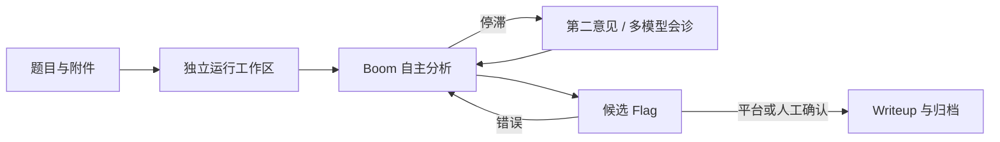

<div align="center">

# CTF-Boom

**面向 CTF 的自主 AI 解题 Agent 与桌面工作台**

从题目导入、隔离分析和多模型会诊，到 Flag 审核、证据留痕与 Writeup 生成。


</div>

> [!IMPORTANT]
> CTF-Boom 仍处于积极开发阶段，配置格式和运行行为可能变化。请仅在获授权的 CTF、靶场和安全研究环境中使用。

## 项目简介

CTF-Boom 是一个以证据为中心的自动化 CTF 解题系统。它把题目文件、模型推理、工具调用、候选 Flag、人工或平台判定以及最终 Writeup 组织在同一个可追踪的任务生命周期中。

项目名称为 **CTF-Boom**；产品内的默认 Agent 名称为 **Boom**，命令行入口为 `boom`。

与一次性聊天不同，Boom 会为每道题创建独立工作区，持续保存关键发现和分析产物；当主模型陷入停滞时，可以发起受限的第二意见或多模型会诊，并在原任务上下文中继续推进。

## 核心能力

- **自主解题**：面向 `WEB`、`PWN`、`REVERSE`、`CRYPTO`、`MISC`、`MOBILE`、`FORENSICS`、`AI`、`HARDWARE`、`BLOCKCHAIN`、`OSINT` 等题型进行分类与分析。
- **隔离工作区**：每次运行复制题目输入，分析文件统一写入 `work/`，关键结论沉淀到 `NOTES.md`。
- **候选 Flag 生命周期**：发现候选值后立即暂停解题，等待比赛平台或用户判定；错误候选会被记录并继续分析，只有确认正确后才进入 Writeup 流程。
- **多模型协作**：支持 Economy / Strong 两档模型、停滞时的只读第二意见，以及由 2–4 个专家模型和 Strong 模型汇总的会诊流程。
- **模型热切换**：任务运行期间可调整模型或 Provider 配置；Boom 会在安全边界完成交接，并保留工作区、笔记和已完成的工具结果。
- **可审计执行**：支持 `managed`、`isolated`、`static-only` 三种执行模式，带命令超时、输出限制、重复调用检测和审计记录。
- **桌面工作台**：macOS 原生窗口提供题目队列、实时事件、历史记录、证据查看、任务取消、Flag 审核和 Writeup 触发；也提供浏览器兼容模式。
- **Provider 与凭据隔离**：支持 OpenAI-compatible Chat Completions、OpenAI Responses 和 Anthropic Messages；凭据保存在 Boom 私有存储中，不会隐式继承 OpenCode 配置。
- **平台接入**：可从 OpenAPI 文档生成声明式比赛适配器，用于题目同步、附件下载和 Flag 提交；内置 DASCTF CTF2 练习场识别。
- **Boom 托管 MCP**：远程或本地 MCP Server 由 Boom 单独配置、启停和授权，不读取用户全局或题目目录中的 OpenCode MCP 配置。

## 工作流程



## 快速开始

### 环境要求

- [Bun](https://bun.sh/) 1.3 或更高版本（项目锁定版本见 `package.json`）
- 可用的模型 Provider 与模型凭据
- 一个明确配置的 Python / Conda 环境
- macOS：可使用原生桌面客户端；其他环境可使用 CLI 或浏览器界面
- 可选：Docker 或 Podman，用于 `isolated` 执行模式

### 从源码安装

克隆仓库并进入项目目录后执行：

```sh
bun install
bun link
boom doctor
```

`boom doctor` 会检查 Bun、运行时、Provider、Agent 资源、Python 环境、MCP Server 和容器隔离能力。如果结果显示 `Python unconfigured`，请先在桌面设置中创建 Python 环境配置，或运行任务时传入 `--python` / `--python-profile`。

### 启动桌面工作台

仓库自带六道本地示例题：

```sh
boom gui --root ./examples/ctf
```

首次启动后，在 **设置** 中完成：

1. 连接 Provider 并选择 Economy / Strong 模型；
2. 选择现有 Python 解释器或 Conda 环境；
3. 按需配置多模型会诊池、MCP Server 和比赛平台。

浏览器兼容模式：

```sh
boom gui --browser --root ./examples/ctf
```

仅启动本地 API，不自动打开窗口：

```sh
boom gui --headless --root ./examples/ctf
```

### 通过 CLI 解题

运行单道示例题：

```sh
boom run --root ./examples/ctf \
  --strong-model <provider/model> \
  --economy-model <provider/model> \
  --python /absolute/path/to/python3 \
  warmup-base64
```

省略题目 slug 时，Boom 会并发处理 `<root>/challenges` 下的全部题目：

```sh
boom run --root ./examples/ctf \
  --strong-model <provider/model> \
  --economy-model <provider/model> \
  --python-profile <profile-id>
```

常用限制参数：

```sh
boom run --root ./ctf \
  --tokens 1000000 \
  --minutes 60 \
  --repeats 5 \
  --concurrency 4 \
  <challenge-slug>
```

查看完整帮助：

```sh
boom --help
```

## 题目目录规范

推荐按类别组织题目：

```text
ctf/
├── challenges/
│   ├── WEB/
│   │   └── login-bypass/
│   │       ├── README.md
│   │       ├── meta.json
│   │       └── attachments...
│   ├── PWN/
│   ├── REVERSE/
│   ├── CRYPTO/
│   └── MISC/
├── eval/
│   └── answers.txt
└── runs/
```

- `README.md`：可选的题目描述。
- `meta.json`：可记录 `category`、`difficulty`、远程地址和 Flag 格式等元数据。
- `eval/answers.txt`：可选评测答案，格式为 `<slug> <flag>`；答案不会复制进 Agent 的运行工作区。
- `runs/<slug>/<run-id>/`：每次运行的独立目录，包含题目快照、事件、笔记、分析产物和结果。

旧版扁平结构 `challenges/<slug>/` 仍可读取，并归类为 `OTHER`。所有类别中的 slug 必须全局唯一。

## 模型、会诊与执行环境

Boom 使用一套持久化的双模型策略：

- **Strong**：负责主解题流程和会诊汇总。
- **Economy**：负责受限的停滞第二意见；两档也可以选择同一个模型。

重复 2–4 次 `--consult` 可以在 CLI 中配置会诊专家池，并在任务开始时进行规划会诊：

```sh
boom run --root ./ctf \
  --strong-model <provider/strong-model> \
  --economy-model <provider/economy-model> \
  --consult <provider/expert-a> \
  --consult <provider/expert-b> \
  --python-profile <profile-id> \
  <challenge-slug>
```

执行模式：

| 模式 | 用途 |
| --- | --- |
| `managed` | 默认模式，在经过清理的任务环境中执行并记录审计信息 |
| `isolated` | 使用可用容器运行时进行非 root 隔离执行 |
| `static-only` | 不允许运行未知程序，只进行静态分析 |

每个任务都会绑定明确的 Python 环境。Boom 不会在未配置时静默回退到其他解释器。

## 比赛平台接入

对于提供机器可读 OpenAPI 的比赛平台，可以生成声明式适配器：

```sh
boom platform adapt \
  --id my-ctf \
  --document ./openapi.yaml \
  --root ./ctf

boom platform inspect --id my-ctf --root ./ctf

export BOOM_PLATFORM_MY_CTF_TOKEN='your-token'
boom platform sync --id my-ctf --root ./ctf --var game_id=42
```

当接口参数、认证方式或判题映射存在歧义时，生成结果会保持 `draft` 并拒绝自动执行。凭据只通过环境变量名称引用，不会写入题目或运行目录。更多信息见 [平台适配器文档](./docs/PLATFORM_ADAPTERS.md)。

## MCP Server

Boom 将 MCP 配置保存在 `$BOOM_HOME/mcp.json`；未设置 `BOOM_HOME` 时，默认目录为 `~/.config/boom`。

```sh
# 远程 MCP Server；敏感值通过环境变量模板引用
boom mcp add remote-tools \
  --url https://example.com/mcp \
  --header 'Authorization=Bearer {env:MCP_TOKEN}'

# 本地 stdio MCP Server；命令以参数数组执行，不经过 shell
boom mcp add filesystem -- \
  npx -y @modelcontextprotocol/server-filesystem /data

boom mcp list
boom mcp test remote-tools
```

可以重复使用 `--agent`，将 MCP Server 限定给 `boom`、`boom-worker` 或 `boom-consultant` 等指定角色。

## 运行产物

每次任务运行都会写入：

```text
runs/<slug>/<run-id>/
├── challenge/          # 只读题目快照与标准化元数据
├── work/               # 完整分析、脚本、证据、候选结果和 Writeup
├── NOTES.md            # 可跨轮次复用的关键发现与已排除方向
└── result.json         # 运行状态、成本、Token 与候选 Flag 摘要
```

Boom 不把完整分析塞进聊天记录；可复现证据保留在 `work/`，长期有效的结论保留在 `NOTES.md`。Writeup 是确认 Flag 后单独触发的流程，必须包含可复现步骤和已确认的 Flag。

汇总已有运行结果：

```sh
boom evaluate --root ./ctf
```

## 开发与验证

```sh
bun install
bun run typecheck
bun run test
```

打包并测试本地发布物：

```sh
bun run pack:check
```

该命令会先构建 React 浏览器界面、执行类型检查和测试，再创建 tarball，验证其中包含
`frontend/dist` 与运行时资源，并在临时目录中从零安装后运行 `boom version` 和 `boom doctor`。
常规发布可直接运行 `bun pm pack`；`prepack` 钩子会执行相同的构建与质量检查。

核心实现使用 TypeScript、Bun、React 和 Vite。OpenCode 是当前稳定的产品运行时，所有 OpenCode 特定集成都集中在 `src/runtime.ts` 后面；Boom 自己负责 UI、任务生命周期、隔离配置、模型策略、MCP 管理和凭据引用。

进一步阅读：

- [运行时架构](./docs/RUNTIME_ARCHITECTURE.md)
- [平台适配器](./docs/PLATFORM_ADAPTERS.md)
- [Provider 手动测试](./docs/M5_MANUAL_PROVIDER_TEST.md)
- [第三方软件声明](./THIRD_PARTY_NOTICES.md)

## 安全与责任使用

CTF 题目附件可能包含不可信二进制文件、脚本或网络目标。建议优先使用隔离容器、最小权限凭据和专用测试环境，并在执行前确认题目来源与授权范围。

本项目仅用于合法的 CTF 竞赛、教学、靶场和获授权安全研究。使用者应自行遵守适用法律、比赛规则与目标系统授权边界。

## License

[Apache License 2.0](./LICENSE) © 2026 wbw16 and CTF-Boom contributors
